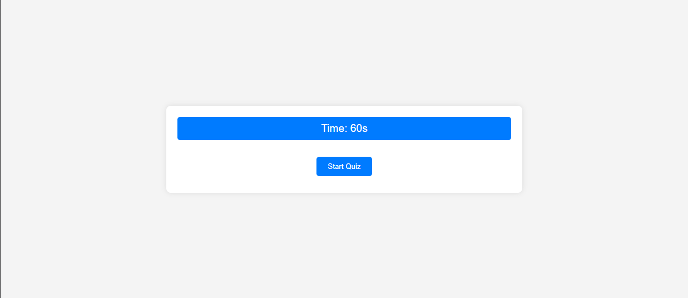

<!-- Repository contains quality readme file with description, screenshot, and link to deployed application.-->

# Coding Quiz Application

## Link to application
https://db-doo.github.io/coding-test/

## Screenshot

## Description

This Coding Quiz Application is an interactive web-based platform designed to test users' knowledge on various programming topics. It provides a fun and engaging way to assess understanding of web development concepts, including HTML, CSS, and JavaScript.

## Features

Interactive Quiz: Timed multiple-choice questions to challenge and assess users' knowledge.

Dynamic Questioning: Questions are presented one at a time, with immediate feedback on correctness.

Score Tracking: The application keeps track of the user's score, which is based on the time remaining after answering all questions.

High Score Leaderboard: Users can view and save their high scores, competing for top spots on the leaderboard.

Responsive Design: The application is designed to be user-friendly and is accessible on various devices and screen sizes.

## Contributions

Much of this project was built over Christmas break, but there were a few things that weren't working quite properly. I started over today and pieced it all together slowly again to help me debug and submit it.

My instructor helped me figure out why my links weren't working. I realized that GitHub doesn't like capital letters in file structures.

I was having so much fun with this project that I decided to also add a few features, like:

* Displaying high scores
* Instant feedback on right/wrong answers
* A working restart button
* A clear high score button
* Time deduction notifications

I used a web app called "WebFlow" to help me understand how to write the CSS styling so the page looked more modern. WebFlow allows me to place elements on a blank webpage, style them as I prefer, and then shows me the underlying code for that styling. It's an incredibly useful tool!

This has been my favorite challenge yet!
